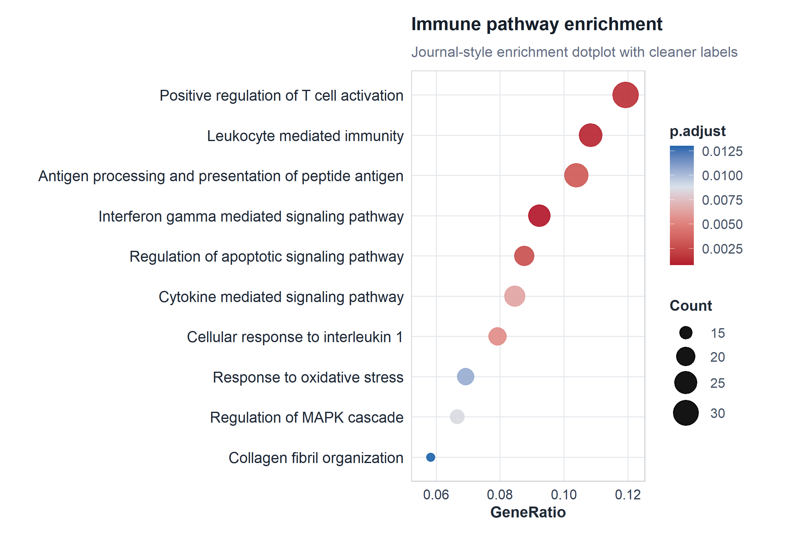
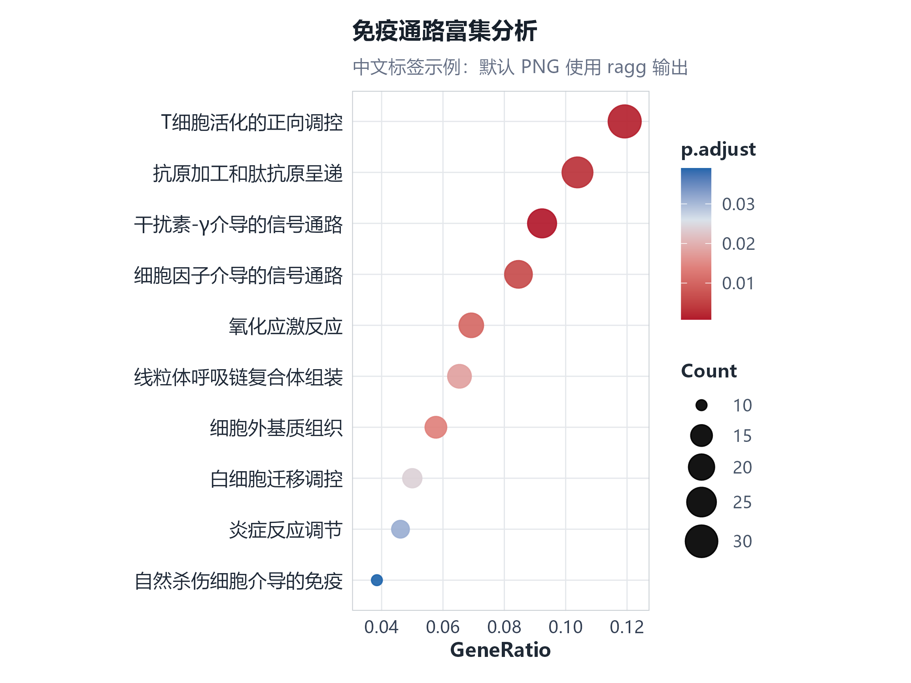

# enrichdot

`enrichdot` draws polished enrichment dotplots from already prepared enrichment
result tables. The default plot intentionally stays close to the common
`clusterProfiler/enrichplot` literature style: `GeneRatio` on the x-axis, terms
on the y-axis, bubble size for `Count`, and bubble color for adjusted p-value.
Its default `journal` palette and theme keep the familiar scientific grammar
while using cleaner labels, restrained colors, and a stable plot panel.

The package does not run GO, KEGG, GSEA, or any other enrichment analysis. It
only upgrades the visual layer.

## Install

```r
install.packages("remotes", repos = "https://cloud.r-project.org")
remotes::install_github("XiaoLi1991-star/enrichdot")
```

## Why enrichdot

Many enrichment dotplots in papers follow a familiar grammar: terms on the
y-axis, `GeneRatio` on the x-axis, `Count` mapped to dot size, and adjusted
p-values mapped to color. `enrichdot` keeps that grammar, but improves the parts
that usually need manual polishing:

- automatic label wrapping and label sizing for long pathway names;
- automatic dot-size ranges that stay readable across small and large result
  tables;
- automatic title, axis, and legend text sizes built from one base size;
- a stable plotting panel, so long labels expand the saved figure instead of
  squeezing the data area;
- three restrained built-in palettes: `journal`, `classic`, and
  `presentation`.

The package is also designed for agent-assisted plotting. Each `enrich_plot()`
call prints the resolved automatic parameters with `message()`. That message is
intentional: an agent can use the actual `wrap_width`, `label_size`,
`dot_min_size`, `dot_max_size`, `width`, `height`, and `panel_width` as the
baseline for the next round of tuning.

## Quick start

```r
library(enrichdot)

example_file <- system.file("extdata", "enrichment_example.tsv", package = "enrichdot")
enrich_result <- read.delim(example_file, stringsAsFactors = FALSE)

p <- enrich_plot(
  enrich_result,
  term = "Description",
  value = "p.adjust",
  count = "Count",
  ratio = "GeneRatio",
  top_n = 10,
  order_by = "ratio",
  layout = "single",
  title = "Immune pathway enrichment",
  subtitle = "Journal-style enrichment dotplot with cleaner labels"
)

save_enrich(p, "enrichment.png")
```

`GeneRatio` can be numeric or a string such as `"12/300"`.

The included example data in `inst/extdata/enrichment_example.tsv` are synthetic
pathway-enrichment-like values created only for package demonstration. They are
not copied or reconstructed from a published article.

By default, `enrichdot` automatically chooses label wrapping, label size,
title/axis/legend text sizes, dot size, output height, and a fixed plot-panel
width. Long pathway labels make the whole figure wider instead of squeezing
the middle plotting area.

Because this package is designed for agent-assisted plotting, `enrich_plot()`
prints the resolved automatic parameters with `message()` every time it draws a
plot. These are the values an agent should use as the baseline for the next
round of tuning:

```text
enrichdot resolved parameters
enrich_plot:
  type: dot
  top_n: 10
  value: p.adjust
  count: Count
  ratio: GeneRatio
  order_by: ratio
  palette: journal
  layout: single
  wrap_width: 64
  label_size: 10.8
  title_size: 13.2
  subtitle_size: 10.32
  axis_title_size: 11.04
  axis_text_size: 9.84
  legend_title_size: 10.56
  legend_text_size: 9.6
  dot_min_size: 2.5
  dot_max_size: 8.4
save_enrich auto defaults:
  width: 7.972
  height: 4.2
  panel_width: 2.35
  width_padding: 0.15
```

Use `suppressMessages(enrich_plot(...))` only when you intentionally want a
quiet R console.

You can still override each part directly when needed:

```r
p <- enrich_plot(
  enrich_result,
  font_family = "Arial",
  wrap_width = 60,
  label_size = 11,
  title_size = 14,
  axis_text_size = 9,
  legend_text_size = 8,
  dot_min_size = 2.5,
  dot_max_size = 8
)

save_enrich(
  p,
  "enrichment.png",
  width = 8,
  height = 6,
  panel_width = 2.1
)
```

The parameter names are intentionally explicit for agent-assisted tuning.

## Parameter guide

### `enrich_plot()`

`enrich_plot()` is the main plotting function. It returns a ggplot object.

Data mapping parameters:

- `data`: A plotting-ready data frame. The package does not run enrichment
  analysis; it only plots prepared enrichment results.
- `term`: Column containing pathway or term names. Default: `"Description"`.
- `value`: Column containing adjusted p-values or FDR values in `[0, 1]`.
  Default: `"p.adjust"`. This controls the color mapping and the `top_n`
  selection order.
- `count`: Column containing gene counts. Default: `"Count"`. This controls
  dot size in dotplots and count labels in barplots.
- `ratio`: Column containing GeneRatio-like values. Default: `"GeneRatio"`.
  Values can be numeric or strings such as `"12/300"`. This controls the
  dotplot x-axis and the default display order.
- `group`: Optional grouping column, for example `"Cluster"` in
  compareCluster-style tables. Default: `NULL`.

Selection and ordering parameters:

- `top_n`: Number of rows to keep per group. Default: `20`. Rows are selected
  by `value` from small to large, so the default keeps the 20 smallest
  `p.adjust` values per group. Use `NULL` to keep all rows.
- `order_by`: Dotplot display order after `top_n` selection. Default:
  `"ratio"`, which orders by the `ratio` column from large to small, matching
  common `enrichplot::dotplot()` behavior. Use `"value"` to display by the
  `value` column from small to large. Barplots keep significance ordering.

Plot structure parameters:

- `type`: Plot type. Use `"dot"` for enrichment dotplots or `"bar"` for
  enrichment barplots. Default: `"dot"`.
- `layout`: Dotplot layout. Default: `"auto"`. With no `group`, it uses a
  single GeneRatio x-axis. With `group`, it switches to a compare-style
  group-on-x-axis dotplot. Use `"single"` to force a single dotplot,
  `"compare"` to require group-on-x-axis layout, or `"facet"` to keep a
  GeneRatio x-axis inside each group.
- `palette`: Built-in palette name. Options are `"classic"`, `"journal"`, and
  `"presentation"`. Default: `"journal"`.
- `wrap_width`: Character width used to wrap long pathway labels. Default:
  `"auto"`. Use a number such as `60` for manual wrapping.
- `title`: Optional plot title. Default: `NULL`.
- `subtitle`: Optional plot subtitle. Default: `NULL`.
- `xlab`: Optional x-axis title override. Default: `NULL`, which uses
  `GeneRatio`, group, or `-log10(adjusted p-value)` depending on plot type.

Typography parameters:

- `base_size`: Base font size for automatic text sizing. Default: `12`.
- `font_family`: Font family passed to ggplot2. Default: `""`, which uses the
  current graphics device default.
- `title_size`: Plot title font size. Default: `"auto"`.
- `subtitle_size`: Plot subtitle font size. Default: `"auto"`.
- `axis_title_size`: X-axis title font size. Default: `"auto"`.
- `axis_text_size`: X-axis tick-label font size. Default: `"auto"`.
- `label_size`: Y-axis pathway label font size. Default: `"auto"`. This is the
  main parameter to adjust when left-side labels look too small or too dense.
- `legend_title_size`: Legend title font size. Default: `"auto"`.
- `legend_text_size`: Legend label font size. Default: `"auto"`.

Dot size parameters:

- `dot_min_size`: Minimum displayed dot size for the `count` mapping. Default:
  `"auto"`.
- `dot_max_size`: Maximum displayed dot size for the `count` mapping. Default:
  `"auto"`. This is the main parameter to adjust when bubbles look too large
  or too small.

Panel style parameters:

- `panel_background_color`: Color behind the plotting panel. Default:
  `"white"`.
- `plot_background_color`: Color for the whole figure and legend background.
  Default: `"white"`.
- `grid`: Panel grid density. Options are `"both"`, `"x"`, and `"none"`.
  Default: `"both"`.
- `grid_color`: Major grid line color. Default: `"#E4E7EB"`.
- `grid_linewidth`: Major grid line thickness. Default: `0.32`.
- `border_color`: Panel border color. Default: `"#C8CDD2"`.
- `border_linewidth`: Panel border thickness. Default: `0.45`.

### `save_enrich()`

`save_enrich()` saves a ggplot with enrichment-friendly output sizing.

- `plot`: A ggplot object, usually returned by `enrich_plot()`.
- `filename`: Output file path, such as `"enrichment.png"` or
  `"enrichment.pdf"`.
- `width`: Output width in inches, or `"auto"`. Default: `"auto"`.
- `height`: Output height in inches, or `"auto"`. Default: `"auto"`.
- `dpi`: Raster output resolution. Default: `320`.
- `device`: Optional graphics device passed to `ggplot2::ggsave()`. Default:
  `NULL`. For `.png` files, enrichdot uses `ragg::agg_png` by default for
  cleaner raster text and better system-font rendering; other extensions keep
  the standard `ggsave()` device behavior.
  For Chinese PDF output, use an available CJK font in `enrich_plot()` and
  save with `device = grDevices::cairo_pdf`, optionally passing
  `family = "Microsoft YaHei"` through `save_enrich()`.
- `panel_width`: Fixed middle plotting panel width in inches, `"auto"`, or
  `NULL`. Default: `"auto"`. Use a number to keep the plotting area stable
  when labels are long; use `NULL` for standard ggplot2 layout.
- `auto_width`: Whether to expand the output width so labels, legends, and a
  fixed panel fit without squeezing the panel. Default: `TRUE`.
- `width_padding`: Extra width added after automatic width measurement.
  Default: `0.15`.
- `...`: Additional arguments passed to `ggplot2::ggsave()`.

### `inspect_enrich_plot()`

`inspect_enrich_plot()` returns agent-friendly diagnostics and suggested
parameters. It accepts the same data mapping and visual tuning parameters as
`enrich_plot()`, plus output-size parameters from `save_enrich()`.

- `data`, `term`, `value`, `count`, `ratio`, `group`, `top_n`, `order_by`,
  `layout`, `palette`, `wrap_width`, `label_size`, `dot_min_size`,
  `dot_max_size`, `base_size`, `font_family`, `title_size`, `subtitle_size`,
  `axis_title_size`, `axis_text_size`, `legend_title_size`,
  `legend_text_size`, `panel_background_color`, `plot_background_color`,
  `grid`, `grid_color`, `grid_linewidth`, `border_color`, and
  `border_linewidth`: Same meaning as in `enrich_plot()`.
- `width`, `height`, `panel_width`, and `width_padding`: Same meaning as in
  `save_enrich()`.

The returned object contains:

- `metrics`: Data diagnostics, such as term count, label length, count spread,
  and p-value range.
- `suggested_params$enrich_plot`: Resolved plotting parameters that an agent
  can pass back into `enrich_plot()`.
- `suggested_params$save_enrich`: Resolved output-size parameters that an
  agent can pass into `save_enrich()`.
- `resolved`: Resolved layout, palette, ordering, and `top_n` values.
- `notes`: Short warnings or tuning hints.

### `enrich_palette()`

`enrich_palette()` exposes the built-in palettes.

- `name`: Palette name. Options are `"classic"`, `"journal"`, and
  `"presentation"`. Default: `"journal"`.

### `theme_enrich()`

`theme_enrich()` returns the default ggplot2 theme used by the package. Most
users should tune these through `enrich_plot()`, but the theme is available for
advanced ggplot workflows.

- `base_size`: Base font size. Default: `12`.
- `font_family`: Font family. Default: `""`.
- `legend_position`: Legend position passed to ggplot2. Default: `"right"`.
- `title_size`: Plot title font size, or `"auto"`.
- `subtitle_size`: Plot subtitle font size, or `"auto"`.
- `axis_title_size`: X-axis title font size, or `"auto"`.
- `axis_text_size`: Axis tick-label font size, or `"auto"`.
- `label_size`: Optional y-axis label size. Default: `NULL`, which inherits
  the theme default.
- `legend_title_size`: Legend title font size, or `"auto"`.
- `legend_text_size`: Legend label font size, or `"auto"`.
- `panel_background_color`: Color behind the plotting panel.
- `plot_background_color`: Color for the whole figure and legend background.
- `grid`: Panel grid density: `"both"`, `"x"`, or `"none"`.
- `grid_color`: Major grid line color.
- `grid_linewidth`: Major grid line thickness.
- `border_color`: Panel border color.
- `border_linewidth`: Panel border thickness.

For agent-assisted tuning, inspect the result table first:

```r
diagnosis <- inspect_enrich_plot(enrich_result)

diagnosis$metrics
diagnosis$suggested_params$enrich_plot
diagnosis$suggested_params$save_enrich
```

The built-in palettes are intentionally limited to three visual targets:
`classic`, `journal`, and `presentation`. The default palette is `journal`: a
muted red, salmon, blue-gray, and blue scale for adjusted p-values. It is shared
by `enrich_plot()`, `inspect_enrich_plot()`, and `enrich_palette()`, and
`diagnosis$suggested_params$enrich_plot$palette` reports the resolved palette
name explicitly.

If feedback says "labels are too dense", "dots are too large", or "the panel is
too wide", an agent can map that directly to `label_size`, `wrap_width`,
`dot_max_size`, or `panel_width`.

The default journal-style panel uses light x/y grid lines and a thin border.
These can also be tuned explicitly, together with subtle background colors:

```r
p <- enrich_plot(
  enrich_result,
  panel_background_color = "#FBFCFD",
  plot_background_color = "white",
  grid = "both",
  grid_linewidth = 0.28,
  border_linewidth = 0.4
)
```

## Examples

```r
p <- enrich_plot(
  enrich_result,
  layout = "single",
  top_n = 10,
  title = "Immune pathway enrichment",
  subtitle = "Journal-style enrichment dotplot with cleaner labels"
)

save_enrich(p, "man/figures/enrichdot-dot.png", height = 5.4)
```



Chinese labels work the same way when you choose an available CJK font. PNG
output uses `ragg::agg_png` by default.



## Main API

- `enrich_plot()` returns a ggplot object.
- `inspect_enrich_plot()` returns agent-friendly diagnostics and suggested parameters.
- `enrich_palette()` exposes the built-in palettes.
- `theme_enrich()` provides the default theme.
- `save_enrich()` saves PNG, PDF, SVG, or other `ggsave()` outputs.

## Data contract

`enrichdot` expects a table with plotting-ready columns:

- term name, usually `Description`;
- adjusted p-value or FDR column in `[0, 1]`;
- gene count;
- gene ratio, either numeric or `"k/n"`;
- optional grouping column for compare-style or faceted dotplots.

This keeps the package predictable and easy to combine with `clusterProfiler`,
`enrichr`, custom ORA outputs, or manually curated pathway tables.
